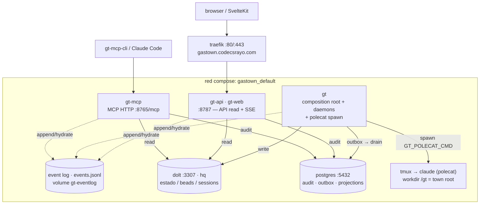

# Deployment — visión general del runtime

Cómo se **orquesta el sistema vivo** (no el diseño del código — eso está en
[`../01-architecture.md`](../01-architecture.md)). Aquí: los servicios que corren, cómo se
hablan, dónde vive el estado. Stack desplegado por `docker-compose.yml` (proyecto `gastown`).

## Diagrama maestro

> Cada bin (`gt`, `gt-api`, `gt-mcp`) boota su **propio** composition root; **no comparten
> memoria** — sincronizan por los 3 planos compartidos (event log + Dolt + Postgres).

## Cómo se orquesta (en una frase por pieza)

- **dolt / postgres** — los dos motores de persistencia. Dolt guarda el estado de dominio
  (beads, sessions, convoys…); Postgres guarda el audit log canónico, el outbox y las
  proyecciones read-side. Ver [`02-data-stores.md`](02-data-stores.md).
- **gt** — el cerebro: corre los actores de dominio, drena el outbox, y los daemons vivos
  (refinery/witness/deacon/estop/mayor) que **actúan solos** y **spawnean polecats** (agentes
  `claude` en tmux). Ver [`03-orchestration.md`](03-orchestration.md).
- **gt-api** — la cara HTTP read-side (snapshots + SSE) que consume el frontend. Hereda el
  dominio público vía traefik.
- **gt-mcp** — expone el control como herramientas MCP (tools validate/execute + resources)
  para clientes LLM / `gt-mcp-cli`. Ver [`04-mcp.md`](04-mcp.md).

Detalle de cada servicio (imagen, puertos, env): [`01-services.md`](01-services.md).

Para el stack de observabilidad (Prometheus + Grafana sobre el mismo compose):
[`05-observability.md`](05-observability.md).

## Regla clave

Los 3 bins (`gt`, `gt-api`, `gt-mcp`) son **procesos independientes**, cada uno con su propio
composition root en memoria. **No comparten estado por RAM** — se coordinan a través del
**event log** (append compartido), **Dolt** (snapshots de estado) y **Postgres** (audit +
proyecciones). El único **escritor de orquestación con efectos** (spawn, merge) es `gt`.
