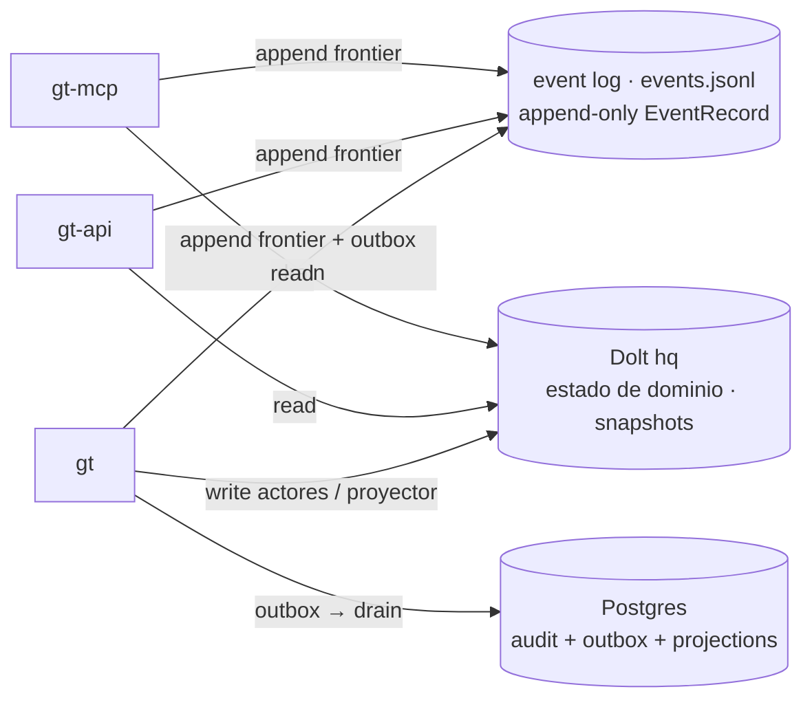

# Deployment — los 3 planos de datos

El estado vive en tres lugares, cada uno con un dueño y un rol distinto. Saber **quién
escribe qué** es la clave para entender por qué los bins no comparten memoria y aun así
convergen.

## 1. Event log — `events.jsonl` (volume `gt-eventlog`)

- **Append-only**, formato `EventRecord` (`{event_id, correlation_id, causation_id, ts, type,
  payload}`). Ver [`../03-events.md`](../03-events.md).
- **Los tres bins lo comparten** (mismo volume, mismo path `/var/lib/gastown/events.jsonl`).
  Cada uno appendea sus eventos de frontera; al boot cada bin **hidrata** su estado plegando
  el log (`hydrated from N records`).
- Es la **columna vertebral** de coordinación: lo que un bin escribe, otro lo ve al rehidratar
  o por su propio stream.

## 2. Dolt — DB `hq` (volume `dolt-data`)

- Estado de dominio persistente: beads, `sessions`, convoys, merge slots, patrol leases…
- `gt` escribe (proyector de sessions, actores); `gt-api` y `gt-mcp` **leen** snapshots para
  servir `/api/*` y los resources `gt://*`.
- MySQL-wire → soporta el patrón outbox igual que Postgres.

## 3. Postgres — audit + outbox + projections (volume `gt-pgdata`)

- **`audit_events`** — log canónico, una fila por `EventRecord` (`event_id` PRIMARY KEY +
  `ON CONFLICT DO NOTHING` → idempotente; dos escritores no duplican).
- **`outbox_events`** — cola durable; `gt` la escribe desde el broadcast y la drena hacia
  `audit_events` + `feed_projections` (entrega *at-least-once*, recuperable tras crash).
- **`feed_projections` / `activity_projections`** — vistas read-side materializadas para el
  feed/actividad. Ver [`../04-persistence.md`](../04-persistence.md) y
  [`../06-observability.md`](../06-observability.md).

## Quién escribe qué (resumen)

| Plano | Escritor principal | Lectores |
|---|---|---|
| event log | todos (append frontier) | todos (hydrate/stream) |
| Dolt `hq` | `gt` (actores/proyector) | `gt-api`, `gt-mcp` (read) |
| PG outbox/audit | `gt` (pipeline) | `gt-feed` / proyecciones |

El **outbox solo lo drena `gt`**. `gt-api`/`gt-mcp` appendan audit directo (idempotente) pero
no corren el pipeline de orquestación.
