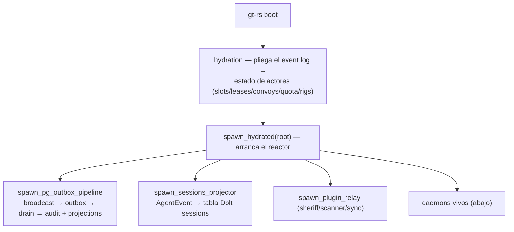
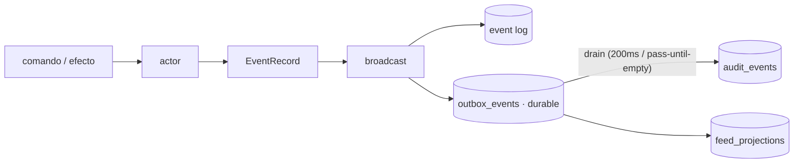
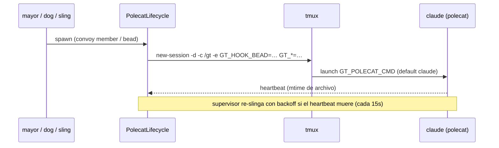

# Deployment — flujo de orquestación (el daemon `gt`)

`gt` (composition root, `bins/gt`) es el único proceso con **efectos de orquestación**: corre
los actores, drena el outbox, los daemons vivos, y **spawnea agentes**. Aquí, qué hace al boot
y en régimen.

## Al boot

## Pipeline de eventos

El outbox garantiza que ningún evento se pierde entre el broadcast y el audit (recuperable
tras crash). En `SIGTERM`, `gt` drena el outbox a cero antes de salir (gate: 0 filas perdidas).

## Daemons vivos (solo `gt`, no `gt-api`)

| Daemon | Qué vigila | Acción |
|---|---|---|
| **mayor loop** | escanea orquestación cada 60s | delega convoys lanzados → **spawn** de polecats |
| **refinery** | canal `/gt/.channels/merge-ready` | avanza merge slots (merge real con git) |
| **witness** | targets vigilados cada 30s | escalation de huecos/stuck |
| **deacon / estop** | canal operador `/gt/.channels/estop` | drain/shutdown ordenado |
| **warrant** | canal `/gt/.channels/warrant` | acción de operador |
| **polecat supervisor** | heartbeats cada 15s | re-sling de polecats muertos (backoff) |
| **dog control** | canal `/gt/.channels/dog` | spawn de dogs por mensaje |

## Spawn de un polecat (el agente)

- Un polecat = un proceso **`claude`** corriendo en una sesión tmux detached, workdir
  `GT_RIG_PATH` (= `/gt`, el town root montado).
- `GT_HOOK_BEAD` se inyecta al env de la sesión (el bead que el polecat debe trabajar).
- Heartbeat por mtime de un archivo; el supervisor re-slinga si muere.
- **`GT_POLECAT_CMD=true`** reemplaza `claude` por un no-op → los daemons corren pero no
  gastan API ni levantan agentes reales (modo prueba).

## Qué dispara trabajo

Con convoys/canales **vacíos**, todos los daemons idlean (el mayor escanea y no halla nada que
delegar). El trabajo arranca cuando algo **lanza un convoy** o postea al canal merge-ready —
típicamente vía un tool MCP (`orch.launch_convoy.execute`). Ver [`04-mcp.md`](04-mcp.md).

## Runtime requerido

`gt` necesita la imagen full (`Dockerfile.orchestrator`): `claude`, `tmux`, `git`, `bd`. La
imagen slim de `gt-api`/`gt-mcp` **no** puede spawnear (sin tmux/claude) — por eso solo `gt`
es el orquestador.
