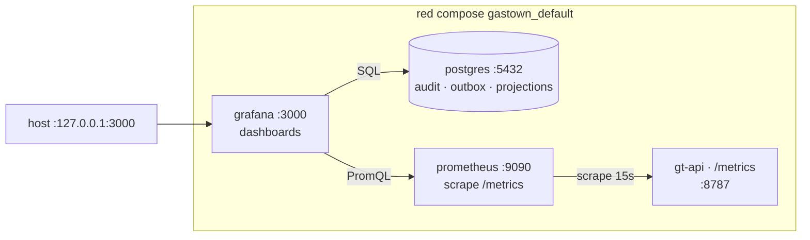

# Deployment — observabilidad (Grafana + Prometheus)

Stack de observabilidad sobre el compose `gastown`. Capa de lectura encima de los datos
que ya emiten los bins; no agrega lógica ni transforma estado.

## Topología



## Servicios

| Servicio | Imagen | Bind | Volume | Para qué |
|---|---|---|---|---|
| `prometheus` | `prom/prometheus:v2.55.0` | interno `:9090` | `gt-prometheus` (TSDB, 15d retention) | scrape `gt-api:8787/metrics` |
| `grafana` | `grafana/grafana-oss:11.3.0` | host `127.0.0.1:3000` + traefik HTTPS | `gt-grafana` (state) | UI + dashboards |

Prometheus es interno (sin host port, sin traefik). Grafana se publica por dos caminos:

1. **Host loopback** `127.0.0.1:3000` — acceso local sin DNS, útil para validar antes de
   wirear el subdominio.
2. **Traefik HTTPS** sobre `${GRAFANA_DOMAIN:-grafana.gastown.codecsrayo.com}` — patrón
   idéntico a `gt-api`: router HTTP `gastown-grafana-http` redirige 307 a HTTPS, router
   `gastown-grafana` termina TLS con `certresolver=netlify`. Requiere DNS A/AAAA del
   subdominio apuntando al host del traefik proxy.

Envs Grafana asociadas: `GF_SERVER_DOMAIN`/`GF_SERVER_ROOT_URL` para que la app genere
URLs absolutas correctas (links de alertas, OAuth redirect, etc.).

## Datasources (provisionados)

`deploy/observability/grafana/provisioning/datasources/datasources.yml` registra dos:

| UID | Nombre | Tipo | URL |
|---|---|---|---|
| `prometheus` | Prometheus | prometheus | `http://prometheus:9090` |
| `pg-gastown` | Postgres-gastown | postgres | `postgres:5432` db `gastown` |

Ambos `editable: false` — no se modifican desde la UI; el archivo es la fuente.

## Dashboards (provisionados)

`deploy/observability/grafana/dashboards/` se monta como provider de tipo `file`.
Cada `.json` se descubre al boot y se refresca cada 30 s.

Dashboard inicial: `gastown-overview.json` — UID `gastown-overview`. Paneles SQL +
PromQL sobre los datos ya existentes (no requiere migraciones nuevas):

| Panel | Datasource | Consulta clave |
|---|---|---|
| `audit_events total` | PG | `SELECT count(*) FROM audit_events` |
| `outbox pending` | PG | `… WHERE drained_at IS NULL` |
| `oldest pending (s)` | PG | `extract(epoch FROM now()-min(ts))` |
| `feed_projections rows` | PG | `SELECT count(*) FROM feed_projections` |
| `gt_events_total (Prom)` | Prom | `sum(gt_events_total)` |
| `gt-web up` | Prom | `up{job="gt-web"}` |
| `audit_events insert rate by kind` | PG | timeseries por minuto |
| `gt_events_total rate (Prom)` | Prom | `sum by (kind) (rate(gt_events_total[5m]))` |
| `Top kinds (time-window)` | PG | barchart |
| `Top feed_projections by value_num` | PG | tabla |
| `Outbox pending (oldest first)` | PG | tabla, debug visual |

## Métricas que ya emiten los bins

`gt-telemetry` expone vía `/metrics` en `gt-api` (puerto 8787, sin auth a propósito —
[`../docs/06-observability.md`](../06-observability.md)). Las series clave:

- `gt_events_total{kind}` — contador por tipo de evento (counter bumped por
  `record_envelope`).
- métricas estándar del runtime Rust (`tokio`, `process_*`, etc.).

`gt` y `gt-mcp` inicializan `gt-telemetry` también — exportan **traces OTEL** vía
`OTEL_EXPORTER_OTLP_ENDPOINT` si está seteado (no scrapeables por Prom; van a Tempo
cuando se agregue). No exponen `/metrics` HTTP propio aún.

## Operación

### Levantar

```sh
docker compose -p gastown up -d prometheus grafana
```

Acceso:

- Local: `http://127.0.0.1:3000`
- Público: `https://${GRAFANA_DOMAIN:-grafana.gastown.codecsrayo.com}` (vía traefik)

Default `admin/admin` — overridable con `GRAFANA_ADMIN_PASSWORD` env. **Cambiar antes de
exponer el subdominio** o tu Grafana queda con credenciales triviales públicas.

### Validar

```sh
# Targets de Prometheus
curl -s http://127.0.0.1:3000/api/datasources/uid/prometheus/health -u admin:admin
# Postgres datasource
curl -s -X POST http://127.0.0.1:3000/api/datasources/uid/pg-gastown/health -u admin:admin
# Dashboard listo
curl -s "http://127.0.0.1:3000/api/search?type=dash-db" -u admin:admin
```

### Editar dashboard

Edits UI → opción "Save" → "JSON model" → pegar en
`deploy/observability/grafana/dashboards/gastown-overview.json` para persistir en repo.

`allowUiUpdates: true` en el provisioner permite ediciones efímeras sin reiniciar; para
versionar hay que sincronizar manualmente al archivo.

## Permisos del bind-mount

Los archivos bajo `deploy/observability/` se montan `:ro`. Prometheus corre como uid
`nobody` (65534) y Grafana como uid `472`; ambos necesitan **lectura** sobre los
archivos y **execute** sobre los directorios. El umask normal de git satisface esto
(`0644` archivos / `0755` directorios). Si un agente crea config con perms `0640`,
Prometheus falla al boot con `permission denied`.

## Qué no entra todavía

- **Tempo / OTEL traces** — `gt-telemetry` ya exporta; falta servicio `tempo` en compose
  + `OTEL_EXPORTER_OTLP_ENDPOINT=http://tempo:4318/v1/traces` en env de `gt`, `gt-api`,
  `gt-mcp`. Próximo paso.
- **Loki / log ingestion** — `vector` o `promtail` sidecar leyendo csvlog de Postgres
  (paso E del plan original). Requiere también prender `pgaudit` + `pg_stat_statements`
  en `postgres` Dockerfile/init.
- **Alertas** — el archivo de provisioning soporta carpeta `alerting/`; vacío por ahora.

Ver el plan completo y orden en el bead `hq-obsv`.
