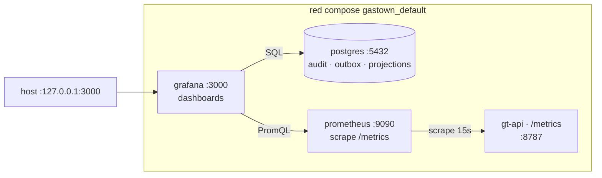

# Deployment — observabilidad (Grafana + Prometheus)

Stack de observabilidad sobre el compose `gastown`. Capa de lectura encima de los datos
que ya emiten los bins; no agrega lógica ni transforma estado.

## Topología



## Servicios

| Servicio | Imagen | Bind | Volume | Para qué |
|---|---|---|---|---|
| `prometheus` | `prom/prometheus:v2.55.0` | interno `:9090` | `gt-prometheus` (TSDB, 15d retention) | scrape `gt-api:8787/metrics` |
| `grafana` | `grafana/grafana-oss:11.3.0` | host `127.0.0.1:3000` + traefik HTTPS | `gt-grafana` (state) | UI + dashboards |

Prometheus es interno (sin host port, sin traefik). Grafana se publica por dos caminos:

1. **Host loopback** `127.0.0.1:3000` — acceso local sin DNS, útil para validar antes de
   wirear el subdominio.
2. **Traefik HTTPS** sobre `${GRAFANA_DOMAIN:-grafana.gastown.codecsrayo.com}` — patrón
   idéntico a `gt-api`: router HTTP `gastown-grafana-http` redirige 307 a HTTPS, router
   `gastown-grafana` termina TLS con `certresolver=netlify`. Requiere DNS A/AAAA del
   subdominio apuntando al host del traefik proxy.

Envs Grafana asociadas: `GF_SERVER_DOMAIN`/`GF_SERVER_ROOT_URL` para que la app genere
URLs absolutas correctas (links de alertas, OAuth redirect, etc.).

## Datasources (provisionados)

`deploy/observability/grafana/provisioning/datasources/datasources.yml` registra dos:

| UID | Nombre | Tipo | URL |
|---|---|---|---|
| `prometheus` | Prometheus | prometheus | `http://prometheus:9090` |
| `pg-gastown` | Postgres-gastown | postgres | `postgres:5432` db `gastown` |

Ambos `editable: false` — no se modifican desde la UI; el archivo es la fuente.

## Dashboards (provisionados)

`deploy/observability/grafana/dashboards/` se monta como provider de tipo `file`.
Cada `.json` se descubre al boot y se refresca cada 30 s.

Dashboard inicial: `gastown-overview.json` — UID `gastown-overview`. Paneles SQL +
PromQL sobre los datos ya existentes (no requiere migraciones nuevas):

| Panel | Datasource | Consulta clave |
|---|---|---|
| `audit_events total` | PG | `SELECT count(*) FROM audit_events` |
| `outbox pending` | PG | `… WHERE drained_at IS NULL` |
| `oldest pending (s)` | PG | `extract(epoch FROM now()-min(ts))` |
| `feed_projections rows` | PG | `SELECT count(*) FROM feed_projections` |
| `gt_events_total (Prom)` | Prom | `sum(gt_events_total)` |
| `gt-web up` | Prom | `up{job="gt-web"}` |
| `audit_events insert rate by kind` | PG | timeseries por minuto |
| `gt_events_total rate (Prom)` | Prom | `sum by (kind) (rate(gt_events_total[5m]))` |
| `Top kinds (time-window)` | PG | barchart |
| `Top feed_projections by value_num` | PG | tabla |
| `Outbox pending (oldest first)` | PG | tabla, debug visual |

## Métricas que ya emiten los bins (hq-obsv.1)

| Bin | `/metrics` HTTP | Llama `record_envelope` | Contenido real |
|---|---|---|---|
| `gt-web` (gt-api) | `:8787/metrics` ✓ | ✗ | registry vacío |
| `gt` (orchestrator) | `:9100/metrics` ✓ | ✓ (`bins/gt/src/root.rs`) | `gt_events_total{kind}` + `gt_dead_letter_total{kind}` con samples reales |
| `gt-mcp` | `:8765/metrics` ✓ (mismo listener que `/mcp`) | ✗ | registry vacío (placeholder hasta instrumentación) |

`gt` cuenta porque el composition root bumpea el counter en su reactor; los otros dos
exponen el endpoint para que cuando se agregue `record_envelope` en sus handlers no haga
falta cambiar Prom ni compose. Prometheus scrapea los 3 jobs (`gt-web`, `gt`, `gt-mcp`)
y agrega bajo el label `service`.

Bind override: `GT_METRICS_BIND` en `gt` (default `0.0.0.0:9100`). gt-mcp comparte el
listener de su HTTP transport — no hay env separado.

### Verificar

```sh
# Targets healthy
docker exec gastown-prometheus wget -qO- 'http://127.0.0.1:9090/api/v1/targets' \
  | jq '.data.activeTargets[] | {job: .labels.job, health, lastError}'

# Counter samples reales
docker exec gastown-prometheus wget -qO- 'http://127.0.0.1:9090/api/v1/query?query=gt_events_total' \
  | jq '.data.result'

# Sample local /metrics body
docker exec gastown-prometheus wget -qO- http://gt:9100/metrics | head -10
```

Los 3 bins inicializan `gt-telemetry` y exportan **traces OTEL** vía
`OTEL_EXPORTER_OTLP_ENDPOINT` (ver sección Tempo).

## Operación

### Levantar

```sh
docker compose -p gastown up -d prometheus grafana
```

Acceso:

- Local: `http://127.0.0.1:3000`
- Público: `https://${GRAFANA_DOMAIN:-grafana.gastown.codecsrayo.com}` (vía traefik)

Default `admin/admin` — overridable con `GRAFANA_ADMIN_PASSWORD` env. **Cambiar antes de
exponer el subdominio** o tu Grafana queda con credenciales triviales públicas.

### Validar

```sh
# Targets de Prometheus
curl -s http://127.0.0.1:3000/api/datasources/uid/prometheus/health -u admin:admin
# Postgres datasource
curl -s -X POST http://127.0.0.1:3000/api/datasources/uid/pg-gastown/health -u admin:admin
# Dashboard listo
curl -s "http://127.0.0.1:3000/api/search?type=dash-db" -u admin:admin
```

### Editar dashboard

Edits UI → opción "Save" → "JSON model" → pegar en
`deploy/observability/grafana/dashboards/gastown-overview.json` para persistir en repo.

`allowUiUpdates: true` en el provisioner permite ediciones efímeras sin reiniciar; para
versionar hay que sincronizar manualmente al archivo.

## Permisos del bind-mount

Los archivos bajo `deploy/observability/` se montan `:ro`. Prometheus corre como uid
`nobody` (65534) y Grafana como uid `472`; ambos necesitan **lectura** sobre los
archivos y **execute** sobre los directorios. El umask normal de git satisface esto
(`0644` archivos / `0755` directorios). Si un agente crea config con perms `0640`,
Prometheus falla al boot con `permission denied`.

## Tempo — trazas OTEL

| Pieza | Detalle |
|---|---|
| Servicio | `tempo` (`grafana/tempo:2.6.0`), interno, volume `gt-tempo` |
| OTLP receivers | gRPC `:4317`, HTTP `:4318` |
| Storage backend | `local` (`/var/tempo/blocks` + `/var/tempo/wal`), retención 48h |
| Datasource Grafana | `uid: tempo`, `url: http://tempo:3200` |
| Config | `deploy/observability/tempo/tempo.yaml` |

Los tres bins (`gt`, `gt-api`, `gt-mcp`) reciben:

```yaml
OTEL_EXPORTER_OTLP_ENDPOINT: ${OTEL_EXPORTER_OTLP_ENDPOINT:-http://tempo:4318/v1/traces}
OTEL_SERVICE_NAME: gt-api          # | gt | gt-mcp
```

`gt-telemetry::init` lee esas envs y conecta el exporter HTTP OTLP a Tempo
(`apps/api/crates/kernel/gt-telemetry/src/lib.rs`).

> **Gap upstream:** el código de dominio actualmente NO tiene `#[tracing::instrument]` en
> handlers de tools / actores / drain (solo el `record_envelope` que adjunta atributos al
> span activo). Sin spans, el exporter no manda nada — Tempo recibe el handshake pero
> queda vacío. Validar el path manualmente: `POST http://tempo:4318/v1/traces` con un
> body OTLP JSON; el batch aparece en Grafana → Explore → Tempo → `Search by Trace ID`.
> Instrumentar handlers es trabajo de un bead separado.

### Validar Tempo

```sh
# Inyectar un trace manual (OTLP/HTTP JSON, fmt mínimo)
TS=$(($(date +%s)*1000000000)); TID=$(printf '%032x' $RANDOM$RANDOM$RANDOM); SID=$(printf '%016x' $RANDOM$RANDOM)
docker exec gastown-tempo wget -q -O- --post-data='{"resourceSpans":[{"resource":{"attributes":[{"key":"service.name","value":{"stringValue":"manual"}}]},"scopeSpans":[{"spans":[{"traceId":"'$TID'","spanId":"'$SID'","name":"probe","kind":1,"startTimeUnixNano":"'$TS'","endTimeUnixNano":"'$(($TS+1000000))'"}]}]}]}' --header='Content-Type: application/json' http://127.0.0.1:4318/v1/traces

# Lookup el trace vía Grafana proxy
curl -s "http://127.0.0.1:3000/api/datasources/proxy/uid/tempo/api/traces/$TID" -u admin:admin | jq .
```

## Outbox telemetry — columnas + vista

Migración: `apps/api/crates/kernel/gt-store-pg/migrations/20260530000001_outbox_telemetry.sql`.

Columnas agregadas a `outbox_events`:

| Columna | Tipo | Rol |
|---|---|---|
| `attempts` | `INTEGER NOT NULL DEFAULT 0` | contador de intentos de drain, bumped en éxito y fallo |
| `last_attempt_at` | `TIMESTAMPTZ` | último intento, sea exitoso o fallido |
| `last_error` | `TEXT` | mensaje del último fallo (truncado a 2000 chars); `NULL` tras un éxito |

Índice `outbox_events_pending_ts` (parcial sobre `drained_at IS NULL`) para barridos
rápidos del panel "stuck".

Vista `v_event_lifecycle` — una fila por evento, joineando outbox + audit + la última
`feed_projections` por correlación:

```
event_id, kind, correlation_id,
event_ts, enqueued_at, drained_at,
attempts, last_attempt_at, last_error,
audit_inserted_at, feed_updated_at,
drain_latency_s, age_s
```

El drain (`PgOutboxDrain::drain_one`) se separa ahora en dos pasos:

1. **Tx principal** — `SELECT ... FOR UPDATE SKIP LOCKED` + audit insert + projection
   upserts + `UPDATE drained_at=now(), attempts++, last_attempt_at=now(), last_error=NULL`.
   Si todo OK → commit y la fila pasa a drained.
2. **Tx de fallo (best-effort)** — si la tx principal rolled back, una segunda tx hace
   `UPDATE attempts++, last_attempt_at=now(), last_error=<trunc>` en una conexión nueva.

Race window pequeña entre rollback y la UPDATE de fallo (otro worker puede tomar la
fila); aceptada porque un éxito posterior reescribe `last_error=NULL` (semántica
correcta). Cubierto por `gt-store-pg/tests/outbox_contract.rs` (asserts: `attempts >= 1`,
`last_attempt_at IS NOT NULL`, `last_error IS NULL`, vista expone `drain_latency_s`).

## Dashboard panels (gastown-overview)

Set extendido a 18 paneles (versión inicial: 11). Nuevos:

| Panel | Datasource | Para qué |
|---|---|---|
| rows with last_error | PG | failures en cola — alert si > 0 |
| rows with retries (attempts > 1) | PG | retries acumulados |
| p95 drain latency (last 1h) | PG via `v_event_lifecycle` | SLO observable |
| max attempts (any row) | PG | cola de zombi: row reintentando ad infinitum |
| Top last_error messages | PG | agrupado por mensaje truncado a 200 chars |
| drain latency distribution (p50/p95 per minute) | PG | timeseries para spotting regresiones |
| Event lifecycle (recent) | PG via vista | tabla con todas las etapas por `event_id` |

## Qué no entra todavía

- **`#[instrument]` en handlers** — sin spans, traces vacíos. Bead separado: instrumentar
  `McpService::run_*`, actors (`gt-scheduling`, `gt-merge`, `gt-patrol`) y el drain
  (`PgOutboxDrain::drain_one`) con `tracing::instrument`. Cada uno se vuelve un span con
  `correlation_id`/`event_id` adjunto vía `record_envelope`.
- **Loki / log ingestion** — `vector` o `promtail` sidecar leyendo csvlog de Postgres
  (paso E del plan original). Requiere también prender `pgaudit` + `pg_stat_statements`
  en `postgres` Dockerfile/init. **Descartado** del plan actual por decisión del usuario.
- **Alertas** — el archivo de provisioning soporta carpeta `alerting/`; vacío por ahora.
  Candidatos obvios: outbox stuck > 5 min, p95 drain > 5s, rows con last_error > 0.

Ver el plan completo y orden en el bead `hq-obsv`.
